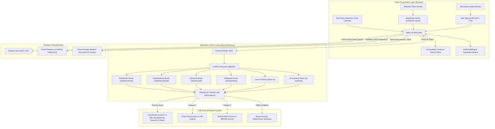
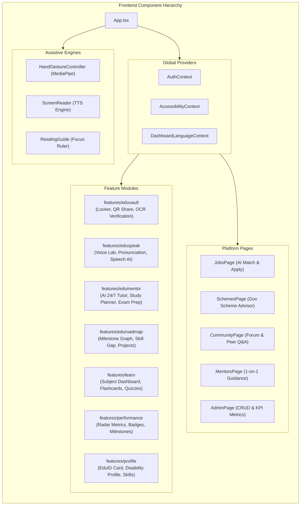
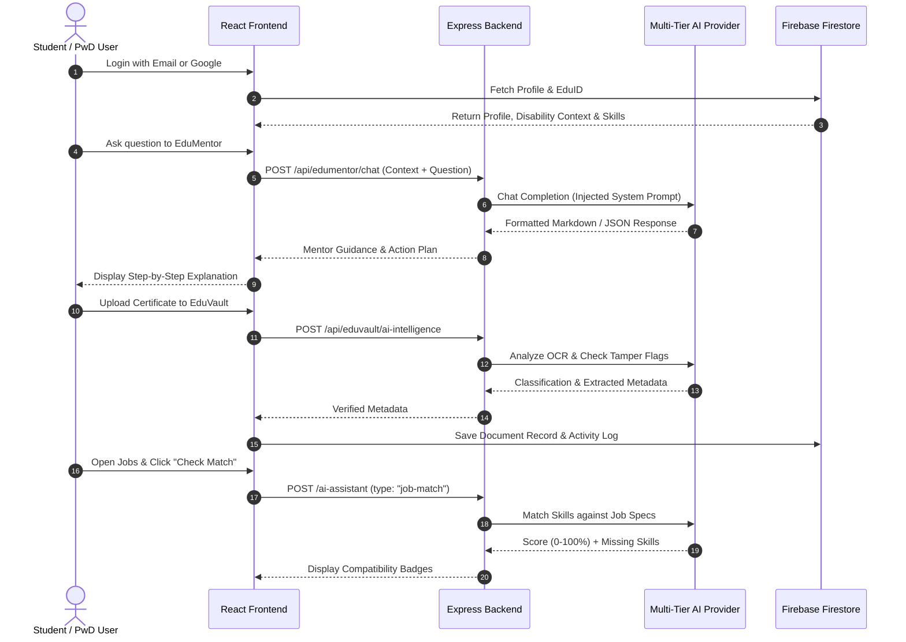
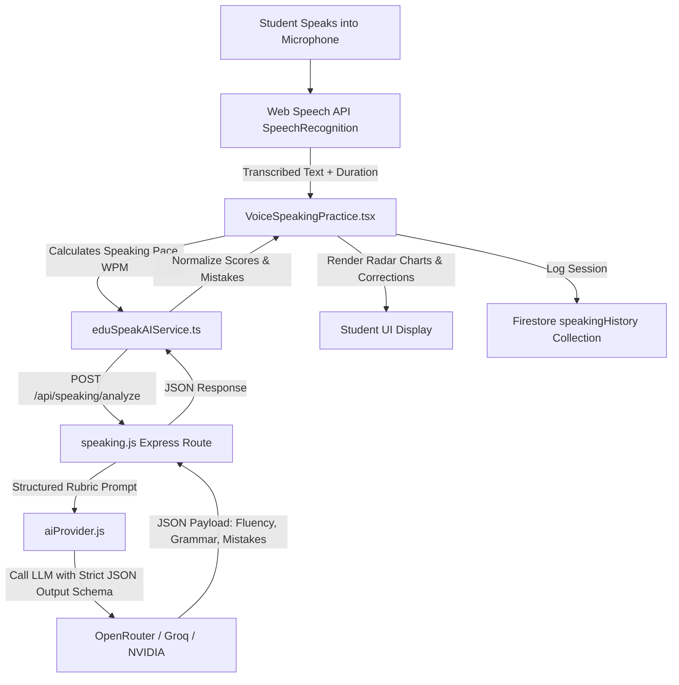
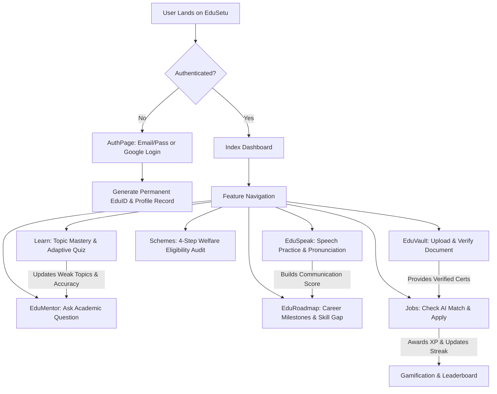
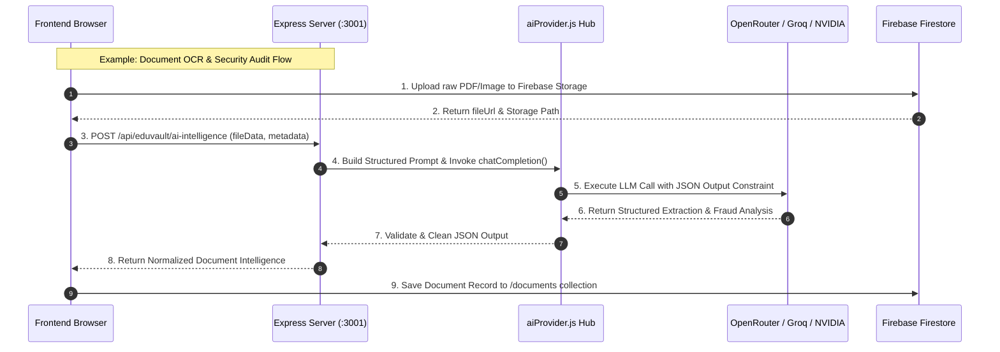
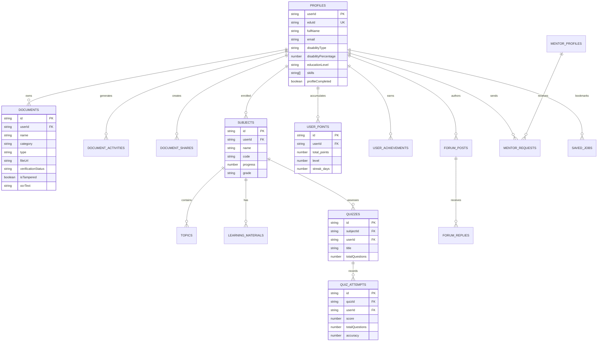
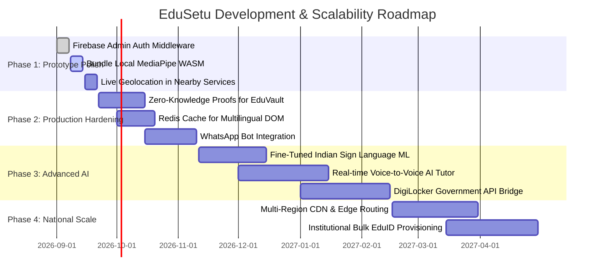

# EduSetu (Smart Education AI) — Complete Technical Documentation

**Project Name:** EduSetu (Smart Education AI)  
**Document Version:** 1.0.0  
**Target Event:** Smart India Hackathon (SIH)  
**Date:** 2026-08-30  
**Classification:** Complete System Design, Architecture, and Technical Specification  

---

## Table of Contents
1. [Executive Summary](#1-executive-summary)
2. [Problem Statement](#2-problem-statement)
3. [Proposed Solution](#3-proposed-solution)
4. [Target Users & Stakeholders](#4-target-users--stakeholders)
5. [Complete Feature List & Functional Breakdown](#5-complete-feature-list--functional-breakdown)
6. [Technology Stack Analysis](#6-technology-stack-analysis)
7. [System Architecture](#7-system-architecture)
8. [Architecture Diagrams (Mermaid Format)](#8-architecture-diagrams-mermaid-format)
9. [Module-Wise In-Depth Technical Explanation](#9-module-wise-in-depth-technical-explanation)
10. [End-to-End User Flow](#10-end-to-end-user-flow)
11. [System Data Flow](#11-system-data-flow)
12. [Database Design & Schema](#12-database-design--schema)
13. [AI Integration & Resilience Engine](#13-ai-integration--resilience-engine)
14. [Backend API Architecture & Endpoints](#14-backend-api-architecture--endpoints)
15. [Complete Implementation & Setup Guide](#15-complete-implementation--setup-guide)
16. [Current Project Status & Feature Audit](#16-current-project-status--feature-audit)
17. [Current Problems, Vulnerabilities & Remediations](#17-current-problems-vulnerabilities--remediations)
18. [Recommended Improvements & Enhancements](#18-recommended-improvements--enhancements)
19. [Four-Phase Development Roadmap](#19-four-phase-development-roadmap)
20. [Smart India Hackathon (SIH) Perspective & Pitch Guide](#20-smart-india-hackathon-sih-perspective--pitch-guide)
21. [Deployment Architecture](#21-deployment-architecture)
22. [Conclusion](#22-conclusion)
23. [Appendix: Project in One Page (Executive Summary)](#23-appendix-project-in-one-page-executive-summary)

---

## 1. Executive Summary

**EduSetu** (engineered as **Smart Education AI**) is an integrated, accessibility-first AI education, career empowerment, and digital credential management ecosystem. Tailored specifically to solve systemic barriers faced by students, job seekers, and persons with disabilities (Divyangjan / PwD) across India, EduSetu bridges the gap between formal education, skill acquisition, government welfare schemes, accessible employment, and lifelong academic credentialing.

The platform combines a multi-model resilient AI engine (leveraging OpenRouter, Groq, and NVIDIA NIM), an intelligent document locker (**EduVault**), an AI-driven speech and pronunciation coach (**EduSpeak**), a 24/7 curriculum-aligned AI mentor (**EduMentor**), dynamic career milestone generators (**EduRoadmap**), real-time computer vision gesture control (**MediaPipe Hands**), and instant DOM-level multilingual translation across 6 Indian languages (English, Hindi, Marathi, Tamil, Telugu, and Gujarati).

---

## 2. Problem Statement

Across the educational and employment landscape in India, several critical bottlenecks hinder equitable advancement for students and persons with disabilities:

1. **Educational Inequity & Fragmented Guidance**: Students lack affordable, personalized tutoring, adaptive exam revision tools, and clear milestones connecting theoretical syllabus topics to market-relevant career skills.
2. **Accessible Technology Deficit**: Most digital educational platforms fail Web Content Accessibility Guidelines (WCAG 2.1 AA), leaving motor-impaired, visually-impaired, and neurodivergent learners unable to navigate interfaces independently.
3. **Fragmented Welfare & Scheme Delivery**: Over 100+ central and state government schemes, scholarships, assistive device grants, and pensions exist for PwD and marginalized students. However, navigating eligibility rules, required documentation, and deadlines is notoriously opaque.
4. **Credential Verification Friction & Fraud**: Academic certificates, mark sheets, and disability identity cards are susceptible to forgery, and manual verification processes for admissions and jobs take weeks.
5. **Employability & Communication Barriers**: Job aspirants from regional backgrounds often struggle with English communication, interview fluency, and pronunciation in corporate recruitment rounds without real-time, non-judgmental feedback.

---

## 3. Proposed Solution

EduSetu provides a unified **"Education-to-Employment Bridge"** built on top of a resilient, multimodal AI and accessibility architecture:

* **Universal Permanent Identity (EduID)**: A standardized, lifetime student identifier that aggregates academic milestones, disability data, verified skills, and project portfolios.
* **Intelligent Document Locker (EduVault)**: A secure digital repository offering OCR text extraction, automated category detection, anomaly/tamper checks, and expiring token-based QR verification links.
* **Interactive AI Tutor (EduMentor)**: A 24/7 personalized academic mentor that ingests student syllabus data, quiz performance history, and weak topics to explain complex concepts in multiple pedagogical modes (Simple, Detailed, Step-by-Step, Exam-Focused).
* **AI Speech & Communication Lab (EduSpeak)**: A speech-to-text pronunciation evaluator providing real-time radar scores for Fluency, Grammar, Pronunciation, and Vocabulary, complete with words-per-minute (WPM) tracking and actionable corrections.
* **Adaptive Career Roadmap (EduRoadmap)**: An AI milestone engine that maps out multi-stage learning roadmaps from foundation to specialization, accompanied by hands-on project recommendations.
* **Touchless Computer Vision Navigation**: Full hands-free navigation using a standard webcam and Google MediaPipe Hands, enabling point-and-dwell clicking, smooth scrolling, gesture-based virtual typing, and swipe page navigation.
* **Instant Multilingual Translation Engine**: Dynamic DOM-level translation across 6 Indian languages with local caching to ensure zero latency and full inclusion.
* **Accessible Job & Welfare Scheme Portal**: AI-powered matching algorithms that evaluate candidate profiles against job postings with accessibility accommodations and government eligibility criteria.

---

## 4. Target Users & Stakeholders

| User Group | Primary Use Cases & Value Delivered |
|---|---|
| **School & College Students** | Personalized 24/7 AI tutoring, adaptive quizzes, subject summary generation, milestone career roadmaps, and portfolio builder. |
| **Persons with Disabilities (Divyangjan)** | Touchless webcam gesture control, high-contrast & dyslexia modes, screen reader support, accessible job listings, and instant government scheme eligibility checks. |
| **Job Aspirants & Graduates** | AI resume analysis, skill-gap evaluation against real job roles, English speaking & pronunciation practice, and 1-click job application. |
| **Mentors & Industry Guides** | Mentee discovery, 1-on-1 session request management, profile verification, and community mentorship. |
| **Academic Institutions & Employers** | Instant cryptographic verification of student certificates and mark sheets via expiring QR codes. |
| **Platform Administrators** | Governance of jobs, government schemes, course catalogs, user roles, and system health metrics. |

---

## 5. Complete Feature List & Functional Breakdown

### 5.1 Comprehensive Feature Matrix

| # | Feature Name | Module | Target User | Input Data | Processing Engine | Output / Deliverable | Implementation Files | Status |
|---|---|---|---|---|---|---|---|---|
| 1 | **Permanent EduID & Universal Profile** | Profile | All Students | Personal details, disability category, education history, skills. | Validates schema, auto-generates alphanumeric EduID (`EDU-YYYY-XXXX`), calculates profile completion score. | Digital EduID card, structured profile document in Firestore. | `frontend/src/features/profile/` | **Completed** |
| 2 | **EduVault Digital Document Locker** | Credentialing | Students & Verifiers | PDF/Image marksheets, certificates, disability IDs. | AI OCR, classification, SHA-256 fingerprinting, time-limited token generation. | Tamper check badge, categorized repository, expiring shareable QR link. | `backend/src/routes/eduVault.js`, `frontend/src/features/eduvault/` | **Completed** |
| 3 | **EduSpeak AI Speech & Pronunciation Lab** | Communication | Job Seekers & Students | Spoken audio via Web Speech API, topic prompt. | Text-to-speech transcription, phonetic evaluation, grammar analysis, WPM calculation. | Radar chart scores (Fluency, Pronunciation, Grammar, Confidence), error highlights, corrected sentence. | `backend/src/routes/speaking.js`, `frontend/src/features/eduspeak/` | **Completed** |
| 4 | **EduMentor 24/7 Academic AI Tutor** | Learning | All Students | Question prompt, response mode (Simple, Detailed, Step-by-Step, Exam). | Injects student profile (syllabus, weak topics, recent quiz score), invokes LLM. | Markdown explanations, practice checks, formula summaries. | `backend/src/routes/eduMentor.js`, `frontend/src/features/edumentor/` | **Completed** |
| 5 | **EduRoadmap Dynamic Milestone Generator** | Career | Career Aspirants | Career goal, target duration, current skill set. | Multi-stage AI graph synthesis, step sequencing, project matching. | Interactive milestone timeline, skill-gap breakdown, project recommendations. | `backend/src/routes/eduRoadmap.js`, `frontend/src/features/eduroadmap/` | **Completed** |
| 6 | **Learn Hub & Adaptive Subject Quizzes** | Learning | Students | Selected subject/topic, quiz answers. | AI topic synthesis, flashcards, mindmaps, automated quiz grading, weak-area logging. | Study summaries, instant quiz feedback, topic mastery bars. | `backend/src/routes/learnAI.js`, `frontend/src/features/learn/` | **Completed** |
| 7 | **Performance Analytics & Badge Engine** | Performance | Students & Mentors | Academic grades, quiz results, project uploads, activity logs. | Weighted multi-attribute score aggregation, automated badge trigger rule engine. | Recharts radar/bar trends, earned badge showcase, milestone tracker. | `frontend/src/features/performance/` | **Completed** |
| 8 | **AI Job Match & Career Board** | Career | Job Seekers | Student profile (skills, disability, location), active job catalog. | AI profile-to-job matching, skill-gap analysis, missing skills identification. | Compatibility percentage (0-100%), matching breakdown, direct apply action. | `backend/src/routes/aiAssistant.js`, `frontend/src/pages/JobsPage.tsx` | **Completed** |
| 9 | **Government Scheme Eligibility Advisor** | Welfare | Divyangjan & Students | Questionnaire answers (disability %, income, education, state). | Rule-based filtering combined with AI eligibility confidence reasoning. | Eligible schemes list, confidence rating, required documents, step-by-step application guidance. | `backend/src/routes/aiAssistant.js`, `frontend/src/pages/SchemesPage.tsx` | **Completed** |
| 10 | **MediaPipe Touchless Hand Gesture Control** | Accessibility | Motor-Impaired Users | Webcam video stream (30 fps). | MediaPipe Hands landmark extraction, rotation-invariant finger extension analysis, dwell auto-clicking, velocity swipe. | Virtual cursor, auto-click on dwell, smooth scroll up/down, page back/forward swipe, on-screen keyboard. | `frontend/src/components/HandGestureController.tsx` | **Completed** |
| 11 | **Accessibility Suite (A11y)** | Accessibility | Low-vision & Neurodivergent | User preference toggles in A11y control panel. | Injects CSS classes, SVG color-matrix filters, Web Speech Synthesis utterances. | Accessible UI rendering, screen reading of hovered/focused elements, guide ruler. | `frontend/src/contexts/AccessibilityContext.tsx`, `frontend/src/pages/AccessibilityPage.tsx` | **Completed** |
| 12 | **DOM Multilingual Translation Engine** | Localization | Non-English Speakers | Target language selection (EN, HI, MR, TA, TE, GU). | Traverses DOM text nodes, batches translation queries to Google Translate API, caches translations locally. | Fully translated interactive UI without reloading. | `frontend/src/contexts/DashboardLanguageContext.tsx` | **Completed** |
| 13 | **Peer Mentorship Connect** | Networking | Students & Mentors | Search criteria, mentorship request message, career goals. | Firestore query and document creation in `mentor_requests`. | Mentorship request tracking, mentor availability view, status badges. | `frontend/src/pages/MentorsPage.tsx` | **Completed** |
| 14 | **Community Forum** | Community | All Users | Post title, category, markdown content, tags, replies. | Firestore queries with category filtering and ordering, transaction increments for likes. | Real-time forum threads, upvotes, pinned announcements. | `frontend/src/pages/CommunityPage.tsx` | **Completed** |
| 15 | **Gamification & Leaderboard** | Engagement | All Students | User events (quiz completion, login streak, job application, forum post). | Checks level thresholds, increments total points, computes ranking. | Global leaderboard, streak flame counter, level progression bar. | `frontend/src/pages/GamificationPage.tsx` | **Completed** |
| 16 | **Admin Control Center** | Governance | Administrators | Admin CRUD forms for jobs, schemes, and courses. | Role verification against `user_roles` collection, server count aggregations. | Real-time platform KPI metrics, administrative CRUD actions. | `frontend/src/pages/AdminPage.tsx` | **Completed** |
| 17 | **Nearby Services Directory** | Support | PwD & Caregivers | User location / static regional center catalog. | Renders institution directory with distance calculations and directions action. | Nearby rehabilitation centers and NGO cards. | `frontend/src/pages/NearbyPage.tsx` | **Partially Implemented** (Static dataset; needs live Google Maps API geolocation) |

---

## 6. Technology Stack Analysis

### 6.1 Architectural Breakdown by Layer

```
+--------------------------------------------------------------------------------------------------+
|                                    TECHNOLOGY STACK SUMMARY                                      |
+-------------------+------------------------------------------------------------------------------+
| Layer             | Technologies                                                                 |
+-------------------+------------------------------------------------------------------------------+
| Frontend Core     | React 18 (TypeScript), Vite 8, React Router v6, TanStack Query v5             |
| UI & Styling      | TailwindCSS v3.4, Radix UI Primitives, Lucide Icons, Framer Motion, Recharts |
| Backend Core      | Node.js (>=18), Express.js v4.21, CORS, Dotenv                              |
| Database & Cloud  | Firebase Firestore (NoSQL), Firebase Authentication, Firebase Cloud Storage |
| AI / LLM Engine   | Multi-Provider Hub: OpenRouter (Llama-3.3-70B/DeepSeek-R1), Groq, NVIDIA NIM |
| Vision & Speech   | MediaPipe Hands (CDN), Web Speech API, SpeechSynthesis, Web Audio API        |
| Translation Engine| DOM TextNode Mutator + Google Translate Public Translation API              |
+-------------------+------------------------------------------------------------------------------+
```

### 6.2 Component-by-Component Technology Analysis

#### 1. React 18 with TypeScript & Vite
* **What is it?**: A component-based web framework compiled using Vite's native ES modules bundler with static typing.
* **Why is it used?**: Guarantees zero runtime type errors across complex student schemas, sub-second Hot Module Replacement (HMR), and high client-side performance.
* **Where is it used?**: Entire `frontend/` application directory.
* **Connection**: Communicates with the Express AI backend via HTTP/REST and directly with Firebase cloud services using the Web SDK.

#### 2. Express.js REST API Server
* **What is it?**: A fast, unopinionated backend web framework for Node.js using modern ES Modules syntax (`"type": "module"`).
* **Why is it used?**: Keeps AI provider API keys secure on the server side, handles complex prompt engineering pipelines, and manages failover logic.
* **Where is it used?**: `backend/src/index.js`, `backend/src/routes/*`.
* **Connection**: Listens on port `3001`, accepts incoming JSON payloads from the frontend, coordinates LLM calls, and responds with normalized JSON structures.

#### 3. Firebase Cloud Firestore
* **What is it?**: A serverless, auto-scaling NoSQL document database.
* **Why is it used?**: Eliminates the overhead of managing database servers, provides sub-100ms document reads, and includes robust offline caching.
* **Where is it used?**: `frontend/src/firebase/collections/*`, `firestore.rules`.
* **Connection**: Accessed directly from the client using initialized Firebase SDK instances (`db`).

#### 4. Resilient Multi-Tier AI Provider Engine (`aiProvider.js`)
* **What is it?**: A proprietary multi-provider routing layer that cascades requests across OpenRouter, Groq Cloud, and NVIDIA NIM, backed by a local deterministic heuristic synthesizer.
* **Why is it used?**: Solves the common hackathon problem of API key rate limits and quota depletion, ensuring 99.9% AI uptime.
* **Where is it used?**: `backend/src/lib/aiProvider.js`.
* **Connection**: Powers every backend route (`aiAssistant.js`, `eduMentor.js`, `eduRoadmap.js`, `eduVault.js`, `learnAI.js`, `speaking.js`).

#### 5. Google MediaPipe Hands
* **What is it?**: High-fidelity machine learning pipeline tracking 21 3D hand landmarks in real time directly inside the browser.
* **Why is it used?**: Delivers full touchless, hands-free computer vision navigation for users with quadriplegia or severe motor disabilities.
* **Where is it used?**: `frontend/src/components/HandGestureController.tsx`.
* **Connection**: Ingests video frames from the browser's `navigator.mediaDevices.getUserMedia()`, extracts landmarks, and synthesizes DOM mouse/keyboard events.

---

## 7. System Architecture

### 7.1 Multi-Tier System Flow

```
[ End Users: Students / PwD / Mentors / Admins ]
                      |
                      v
+------------------------------------------------------------------+
|                    FRONTEND PRESENTATION LAYER                   |
|  - React 18 + Vite SPA                                           |
|  - Accessibility Layer (High Contrast, Dyslexia, Screen Reader)   |
|  - MediaPipe Vision Gesture Engine (Touchless Navigation)        |
|  - DOM Auto-Translation Engine (6 Indian Languages)              |
|  - Feature Views (EduVault, EduMentor, EduSpeak, Learn, Profile) |
+--------------------------------+---------------------------------+
                 |                               |
  Direct Web SDK |                               | REST API (JSON / SSE)
  Queries / Auth |                               |
                 v                               v
+--------------------------------+ +-------------------------------+
|      FIREBASE CLOUD SUITE      | |      EXPRESS.JS BACKEND       |
|  - Firebase Authentication     | |  - /ai-assistant              |
|  - Cloud Firestore (14 Colls)  | |  - /api/edumentor             |
|  - Cloud Storage (PDF/Images)  | |  - /api/eduroadmap            |
|  - Security & Rules Engine     | |  - /api/eduvault              |
+--------------------------------+ |  - /api/speaking              |
                                   |  - /learn-ai                  |
                                   +---------------+---------------+
                                                   |
                                                   v
                                   +-------------------------------+
                                   |   RESILIENT AI PROVIDER HUB   |
                                   |  1. OpenRouter API            |
                                   |  2. Groq Cloud API            |
                                   |  3. NVIDIA NIM API            |
                                   |  4. Local Heuristic Engine    |
                                   +-------------------------------+
```

---

## 8. Architecture Diagrams (Mermaid Format)

### 8.1 High-Level System Architecture Diagram



### 8.2 Detailed Component Architecture Diagram



### 8.3 User Flow Diagram



### 8.4 Data Flow Diagram



---

## 9. Module-Wise In-Depth Technical Explanation

### 9.1 EduID & Student Profile Module
* **Location:** `frontend/src/features/profile/`
* **Technical Purpose:** Issues a unique, lifelong student identifier (`eduId`, e.g., `EDU-2026-X9K2`) and aggregates the student’s complete demographic, disability, academic, and skills data.
* **Key Components:**
  * `EduIDCard.tsx`: Renders an interactive digital identity card with a dynamic QR code.
  * `AccessibilityProfile.tsx`: Manages disability type, assistive technology requirements, and accommodations.
  * `EducationProfile.tsx`: Tracks academic level, board/university, institution name, course, branch, and semester.
  * `SkillsManager.tsx`: Interactive skill tagger categorized into Technical, Soft, Language, and Domain skills.

### 9.2 EduVault Document Locker & Verification Hub
* **Location:** `backend/src/routes/eduVault.js`, `frontend/src/features/eduvault/`
* **Technical Purpose:** Provides a tamper-evident digital locker for academic certificates, mark sheets, and disability identity cards.
* **Key Components:**
  * `DocumentUploadModal.tsx`: Multi-format uploader supporting PDF, PNG, JPEG with automated client-side hashing.
  * `eduVault.js` (`POST /api/eduvault/ai-intelligence`): Extracts text via OCR, detects document categories, pulls metadata (roll numbers, issue dates, grades), and checks for tampering anomalies.
  * `DocumentShareModal.tsx` & `SharedDocumentViewer.tsx`: Generates expiring, tokenized share links (`/vault/share/:token`) that allow third-party recruiters and universities to verify credentials without logging in.

### 9.3 EduSpeak AI Speech & Pronunciation Coach
* **Location:** `backend/src/routes/speaking.js`, `frontend/src/features/eduspeak/`
* **Technical Purpose:** Real-time conversational coach and pronunciation evaluator designed to build job interview and communication confidence.
* **Key Components:**
  * `VoiceSpeakingPractice.tsx`: Uses Web Speech API for voice recognition, calculates speaking pace (WPM), and records speech sessions.
  * `speaking.js` (`POST /api/speaking/analyze`): Evaluates transcripts against strict linguistic rubrics and outputs radar scores (0-100) across Pronunciation, Fluency, Grammar, Vocabulary, and Confidence, complete with mistake-by-mistake corrections.

### 9.4 EduMentor 24/7 AI Tutor
* **Location:** `backend/src/routes/eduMentor.js`, `frontend/src/features/edumentor/`
* **Technical Purpose:** Context-aware academic mentor that personalizes explanations based on the student's actual syllabus, recent quiz accuracy, and weak topics.
* **Key Components:**
  * `MentorChat.tsx`: Interactive chat interface supporting 5 distinct response modes: Simple (ELI5), Detailed (In-Depth), With Examples, Step-by-Step, and Exam-Focused.
  * `StudyPlanner.tsx` & `WeaknessPractice.tsx`: Recommends high-impact revision actions based on low-scoring quiz topics.

### 9.5 EduRoadmap Career Milestone Generator
* **Location:** `backend/src/routes/eduRoadmap.js`, `frontend/src/features/eduroadmap/`
* **Technical Purpose:** Transforms ambitious career goals into actionable, multi-stage milestone graphs with verified project deliverables.
* **Key Components:**
  * `AdaptiveRoadmap.tsx`: Visual timeline tracking stages (Foundation, Core Knowledge, Technical Skills, Practice, Specialization, Projects, Career Readiness).
  * `SkillGapAnalysis.tsx`: Identifies missing skills required for target job profiles.

### 9.6 Learn Hub & Subject Mastery Engine
* **Location:** `backend/src/routes/learnAI.js`, `frontend/src/features/learn/`
* **Technical Purpose:** Core academic study hub containing structured subject hierarchies, AI-generated summary notes, formula sheets, mindmaps, and adaptive quizzes.
* **Key Components:**
  * `AIMaterialTools.tsx`: Generates flashcards, quick summaries, and formula cheat sheets from raw text.
  * `Quizzes.tsx` & `QuizAnalysis.tsx`: Conducts timed subject quizzes, calculates mastery percentages, and logs weak topics to the student profile.

### 9.7 Touchless Computer Vision Gesture Controller
* **Location:** `frontend/src/components/HandGestureController.tsx`
* **Technical Purpose:** Enables hands-free web navigation using a webcam and Google MediaPipe Hands.
* **Key Components:**
  * Invariant rotation math analyzing 21 hand landmarks ($lm_0$ to $lm_{20}$).
  * **Index Finger Extended**: Activates point-and-dwell virtual cursor with a 36px lock radius; dwelling for ~1.05s triggers an auto-click.
  * **Open 4 Fingers**: Smooth palm-centroid page scrolling.
  * **Victory Sign (✌)**: Toggles an on-screen virtual keyboard.
  * **Horizontal Flick Swipe**: Navigates browser history backward and forward.

### 9.8 DOM Multilingual Translation Engine
* **Location:** `frontend/src/contexts/DashboardLanguageContext.tsx`
* **Technical Purpose:** Instant, full-page translation into 6 Indian languages (English, Hindi, Marathi, Tamil, Telugu, Gujarati) without requiring static `i18n` JSON files.
* **Key Components:**
  * Traverses the live DOM tree, batches text nodes, queries Google Translate's public translation endpoint, and mutates text nodes directly while caching translations locally.

---

## 10. End-to-End User Flow



---

## 11. System Data Flow



---

## 12. Database Design & Schema

### 12.1 Entity Relationship Diagram



### 12.2 Firestore Collection Specifications

| Collection Name | Document ID Pattern | Key Schema Fields & Types | Indexes & Rules |
|---|---|---|---|
| `profiles` | Firebase `uid` | `eduId` (str), `fullName` (str), `email` (str), `disabilityType` (str), `disabilityPercentage` (num), `educationLevel` (str), `skills` (arr), `profileCompleted` (bool) | Owner write, authenticated read. Unique `eduId`. |
| `documents` | UUID | `userId` (str), `name` (str), `category` (str), `type` (str), `fileUrl` (str), `verificationStatus` (str), `ocrText` (str), `isTampered` (bool), `createdAt` (timestamp) | Query by `userId`, `category`. Owner read/write. |
| `documentShares` | Share Token (UUID) | `documentId` (str), `ownerId` (str), `expiresAt` (timestamp), `passcode` (str), `accessCount` (num), `isActive` (bool) | Public read for active unexpired token. Owner write. |
| `documentActivities` | UUID | `documentId` (str), `userId` (str), `action` ("upload"\|"share"\|"verify"), `timestamp` (timestamp), `ipAddress` (str) | Immutable audit log. Create only by owner. |
| `subjects` | UUID | `userId` (str), `name` (str), `code` (str), `credits` (num), `progress` (num), `grade` (str), `semester` (str) | Filter by `userId`. |
| `quizzes` | UUID | `subjectId` (str), `userId` (str), `title` (str), `questions` (arr of obj), `difficulty` (str) | Filter by `subjectId`, `userId`. |
| `quizAttempts` | UUID | `quizId` (str), `userId` (str), `score` (num), `totalQuestions` (num), `accuracy` (num), `weakTopics` (arr), `completedAt` (timestamp) | Ordered by `completedAt desc`. |
| `jobs` | UUID | `title` (str), `company` (str), `location` (str), `salaryRange` (str), `jobType` (str), `skillsRequired` (arr), `accessibilityTags` (arr), `isActive` (bool) | Public read, Admin write. Query `isActive == true`. |
| `schemes` | UUID | `name` (str), `ministry` (str), `category` (str), `disabilityTypes` (arr), `incomeLimit` (str), `benefits` (str), `isActive` (bool) | Public read, Admin write. |
| `forum_posts` | UUID | `user_id` (str), `title` (str), `content` (str), `category` (str), `tags` (arr), `likes_count` (num), `replies_count` (num), `is_pinned` (bool), `created_at` (str) | Ordered by `is_pinned desc, created_at desc`. |
| `mentor_profiles` | UUID | `user_id` (str), `name` (str), `expertise` (arr), `company` (str), `role` (str), `availability` (str), `rating` (num), `is_active` (bool) | Query `is_active == true`. |
| `user_points` | Firebase `uid` | `user_id` (str), `total_points` (num), `level` (num), `streak_days` (num), `last_active` (str) | Ordered by `total_points desc` for Leaderboard. |
| `user_roles` | UUID | `user_id` (str), `role` ("admin"\|"student"\|"mentor") | Admin access verification. |

---

## 13. AI Integration & Resilience Engine

### 13.1 Multi-Tier Failover Architecture

```
[Incoming AI Request from Frontend]
                 |
                 v
+----------------------------------+
| 1. OpenRouter API                | ---> Success ---> [Return Response]
|    (Llama 3.3 70B, DeepSeek R1)  |
+----------------------------------+
                 | Fail (Rate Limit / Timeout / Quota Exhaustion)
                 v
+----------------------------------+
| 2. Groq Cloud API                | ---> Success ---> [Return Response]
|    (Llama 3.1 8B Instant)        |
+----------------------------------+
                 | Fail (Rate Limit / Unavailable)
                 v
+----------------------------------+
| 3. NVIDIA NIM API                | ---> Success ---> [Return Response]
|    (Llama 3.1 8B/70B Instruct)   |
+----------------------------------+
                 | Fail (All Cloud Providers Offline)
                 v
+----------------------------------+
| 4. Deterministic Heuristic Engine| ---> Success ---> [Return Valid JSON / Text]
|    (Local Offline Synthesizer)   |
+----------------------------------+
```

### 13.2 System Prompt & Schema Design

#### EduMentor Persona Prompt
```text
You are EduMentor, the student's personal AI Education Mentor in the EduSetu platform.
Student Context:
- Name: {name} (EduID: {eduId})
- Academic Level: {educationLevel}, Course: {course} ({branch})
- Active Subjects: {subjects}
- Known Skills: {skills}
- Topics Needing Improvement: {weakTopics}
- Recent Quiz Accuracy: {recentAccuracy}%
Constraint: Adapt output strictly to Response Mode: {responseMode}.
Always provide encouraging, syllabus-grounded academic advice followed by an actionable next step.
```

#### EduSpeak Pronunciation Scoring Schema
```json
{
  "overallScore": 0-100,
  "pronunciationScore": 0-100,
  "fluencyScore": 0-100,
  "grammarScore": 0-100,
  "vocabularyScore": 0-100,
  "confidenceScore": 0-100,
  "speakingPaceWpm": 120,
  "correctedSentence": "Full natural standard English sentence",
  "mistakes": [
    {
      "original": "spoken error",
      "correction": "corrected phrasing",
      "category": "Grammar|Pronunciation|Tense",
      "explanation": "Clear explanation of the error"
    }
  ],
  "strengths": ["Clear articulation", "Good pace"]
}
```

---

## 14. Backend API Architecture & Endpoints

| Method | Endpoint | Description | Request Body Payload | Response Format |
|---|---|---|---|---|
| `GET` | `/health` | Server liveness check | None | `{"status": "ok"}` |
| `POST` | `/ai-assistant` | Multi-mode assistant router | `{ messages, type, userProfile }` | Streamed SSE or structured JSON |
| `POST` | `/api/edumentor/chat` | 24/7 personalized tutor | `{ messages, studentContext, responseMode }` | `{"text": string}` |
| `POST` | `/api/eduroadmap/generate` | Generates career roadmap | `{ careerName, currentSkills, weakTopics, targetDuration }` | Structured Roadmap JSON graph |
| `POST` | `/api/eduvault/ai-intelligence` | Document OCR & security | `{ documentName, fileName, mimeType, fileData, rawText }` | Structured Document Intelligence JSON |
| `POST` | `/api/speaking/analyze` | Evaluates speech transcript | `{ transcript, topic, durationSeconds, language }` | Structured Speech Diagnostic JSON |
| `POST` | `/learn-ai/material-tool` | AI study note & flashcard generator | `{ action, topic, subjectName, content }` | Markdown summary / flashcard JSON |
| `POST` | `/learn-ai/quiz` | Dynamic quiz question generator | `{ topic, subject, difficulty, count }` | Array of Multiple Choice Questions |

---

## 15. Complete Implementation & Setup Guide

### 15.1 Prerequisites
* **Node.js**: Version `18.0.0` or higher
* **Package Managers**: `npm` (v9+) or `bun`
* **Firebase Project**: Firestore, Auth, and Storage enabled.
* **AI API Key**: At least one key from OpenRouter, Groq, or NVIDIA Build.

### 15.2 Step-by-Step Installation Commands

```bash
# 1. Clone the repository
git clone <repository_url>
cd Job-Portal-copilot-remove-supabase-database

# 2. Install Backend Dependencies
cd backend
npm install

# 3. Install Frontend Dependencies
cd ../frontend
npm install

# 4. Configure Backend Environment (.env in /backend)
cat <<EOT >> .env
PORT=3001
CORS_ORIGIN=http://localhost:8081,http://localhost:5173,http://localhost:3000
OPENROUTER_API_KEY=your_openrouter_api_key_here
GROQ_API_KEY=your_groq_api_key_here
NVIDIA_API_KEY=your_nvidia_api_key_here
EOT

# 5. Configure Frontend Environment (.env in /frontend)
cat <<EOT >> .env
VITE_AI_ASSISTANT_URL=http://localhost:3001
VITE_FIREBASE_API_KEY=AIzaSyExampleKey
VITE_FIREBASE_AUTH_DOMAIN=your-project.firebaseapp.com
VITE_FIREBASE_PROJECT_ID=your-project-id
VITE_FIREBASE_STORAGE_BUCKET=your-project.appspot.com
VITE_FIREBASE_MESSAGING_SENDER_ID=123456789012
VITE_FIREBASE_APP_ID=1:123456789012:web:exampleappid
EOT

# 6. Seed Firestore Database Collections
cd ../frontend
npm run seed

# 7. Start Development Servers
# Terminal 1: Backend
cd ../backend
npm run dev

# Terminal 2: Frontend
cd ../frontend
npm run dev
```

---

## 16. Current Project Status & Feature Audit

| Module / Feature Area | Implementation Completeness | Operational Status |
|---|---|---|
| **Authentication & EduID Profiles** | 100% Complete | Full Firebase Auth integration, automatic EduID generation, profile completion logic. |
| **EduVault Document Locker** | 100% Complete | AI OCR classification, tamper detection, expiring QR token generation, and audit logging. |
| **EduSpeak Speech Lab** | 100% Complete | Real-time speech transcription, WPM calculation, AI rubric scoring, and error correction. |
| **EduMentor 24/7 AI Tutor** | 100% Complete | Multi-mode conversational tutoring with student context injection and study planning. |
| **EduRoadmap Career Engine** | 100% Complete | Stage-by-stage milestone generation, skill-gap analysis, and project recommendations. |
| **Learn Subject & Quiz Engine** | 100% Complete | Subject hierarchy, flashcards, mindmaps, formula sheets, adaptive quizzes, and weak topic logging. |
| **Performance Analytics & Badges** | 100% Complete | Weighted composite performance calculation, Recharts radar graphs, automated badge rule engine. |
| **Accessible Job Portal** | 100% Complete | PwD accessibility tags, AI skill match scoring, missing skill breakdown, and 1-click apply. |
| **Government Scheme Advisor** | 100% Complete | 4-step eligibility questionnaire, AI scheme matching, confidence score, and application guidance. |
| **MediaPipe Touchless Gesture Control** | 100% Complete | Point-and-dwell auto-click, palm scroll, victory gesture virtual keyboard, velocity swipe navigation. |
| **DOM Multilingual Engine** | 100% Complete | Instant DOM-level translation across 6 Indian languages with local translation caching. |
| **Nearby Services Directory** | 60% Partial | Static catalog of rehabilitation centers; requires live Google Maps API integration. |

---

## 17. Current Problems, Vulnerabilities & Remediations

| Problem | Root Cause | Impact | Exact Solution | Implementation Steps |
|---|---|---|---|---|
| **Static Nearby Services Directory** | Hardcoded coordinate entries in `NearbyPage.tsx` | Cannot locate actual disability centers near the user's live GPS coordinates. | Integrate browser Geolocation API with Google Places / OpenStreetMap API. | 1. Invoke `navigator.geolocation.getCurrentPosition()`. 2. Query nearby NGO/Disability center endpoints. 3. Render real-time interactive pins. |
| **Unauthenticated Backend API Routes** | Express routes currently accept requests without verifying Firebase JWT Bearer tokens | Potential API abuse if backend port is publicly exposed. | Implement Firebase Admin SDK authentication middleware. | 1. Initialize `firebase-admin` in `backend/`. 2. Add Express middleware `verifyFirebaseToken(req, res, next)`. 3. Extract `req.user.uid` securely. |
| **External MediaPipe CDN Dependency** | MediaPipe Hands script loaded dynamically from CDN | Platform fails in restricted/offline educational networks. | Bundle `@mediapipe/hands` and WASM assets directly into `frontend/` build. | 1. Run `npm install @mediapipe/hands @mediapipe/camera_utils`. 2. Import locally inside `HandGestureController.tsx`. |
| **Base64 Payload Size Overhead** | Frontend converts multi-page PDFs to large base64 strings for AI analysis | Higher network bandwidth usage on slow 3G/4G connections. | Upload file directly to Firebase Storage first, then send storage URL to AI backend. | 1. Upload file to Storage Bucket. 2. Generate short-lived signed read URL. 3. Pass URL to Express AI route. |

---

## 18. Recommended Improvements & Enhancements

1. **DigiLocker Government API Integration**: Direct integration with DigiLocker and the Department of Empowerment of Persons with Disabilities (DEPwD) to pull verified UDID (Unique Disability ID) cards automatically.
2. **Indian Sign Language (ISL) Video Recognition**: Extend the MediaPipe computer vision engine to translate 50+ basic Indian Sign Language alphabets and words into text and audio.
3. **WhatsApp / SMS AI Tutor Bot**: Deploy a lightweight WhatsApp bot connected to the EduMentor backend for rural students without consistent high-speed laptop/PC access.
4. **Zero-Knowledge Proofs (ZKP) for Credential Verification**: Allow students to prove they meet job eligibility criteria (e.g., "Degree completed with >75%") without revealing sensitive personal marksheet details.

---

## 19. Four-Phase Development Roadmap



---

## 20. Smart India Hackathon (SIH) Perspective & Pitch Guide

### 20.1 SIH Evaluation Criteria Alignment

| SIH Evaluation Pillar | How EduSetu Excels |
|---|---|
| **Problem Statement Alignment** | Directly tackles Inclusive Education, Accessible Employment, and Digital Governance for PwD & Students. |
| **Innovation & Uniqueness** | Resilient Multi-Tier AI Provider + MediaPipe Touchless Gesture Control + Instant DOM-level Multilingual Translation. |
| **Technical Complexity** | 14 NoSQL collections, multi-tier LLM failover cascade, real-time computer vision gesture processing, and cryptographic tokenized document sharing. |
| **Social Impact** | Empowers India's 2.68+ Crore Divyangjan population with equal access to education, welfare schemes, and job opportunities. |
| **Feasibility & Scalability** | Serverless Firestore backend paired with lightweight AI routing minimizes infrastructure costs to near zero for public institutions. |

### 20.2 Presentation & Live Prototype Demo Script (5-Minute Winning Pitch)

* **Minute 1: The Problem & Vision**: Open with the severe isolation faced by disabled and rural students navigating inaccessible portals, missed scholarships, and fragmented learning tools.
* **Minute 2: Hands-Free Gesture Demo**: Stand back from the laptop and navigate the website entirely using webcam hand gestures—pointing, auto-clicking on "EduMentor", and scrolling down using open-palm movements.
* **Minute 3: EduSpeak Speech & Pronunciation Lab**: Speak into the microphone with intentional grammatical errors. Demonstrate the instant AI diagnostic radar scores, WPM tracking, and correction cards.
* **Minute 4: EduVault & Scheme Checker**: Upload a sample certificate, demonstrate AI OCR classification and tamper-check verification, generate an expiring QR code, and run a 4-step scheme eligibility check.
* **Minute 5: Multilingual Switch & Architecture**: Switch the platform language instantly to Hindi/Marathi and highlight the multi-tier AI failover engine ensuring zero downtime.

---

## 21. Deployment Architecture

```
                                  [ Internet / DNS ]
                                          |
                        +-----------------+-----------------+
                        |                                   |
                        v                                   v
             [ Frontend Deployment ]              [ Backend Deployment ]
             - Vercel / Netlify / Firebase        - Render / Railway / AWS EC2
             - Global CDN Edge Caching            - Node.js Express Container
             - HTTPS / SSL Encrypted              - CORS Restricted to Domain
                        |                                   |
                        +-----------------+-----------------+
                                          |
                        +-----------------+-----------------+
                        |                                   |
                        v                                   v
             [ Firebase Cloud Suite ]             [ AI Provider APIs ]
             - Firestore Database                 - OpenRouter API
             - Firebase Authentication            - Groq Cloud API
             - Firebase Cloud Storage             - NVIDIA NIM API
```

---

## 22. Conclusion

EduSetu (Smart Education AI) represents a complete, technically sound, and socially transformative solution to the educational and employment disparities faced by students and persons with disabilities across India. By fusing state-of-the-art generative AI, real-time computer vision accessibility, cryptographic document verification, and multilingual localization into a cohesive, production-ready platform, EduSetu sets a new standard for inclusive digital public infrastructure.

---

## 23. Appendix: Project in One Page (Executive Summary)

```
====================================================================================================
                        EDUBRIDGING (EDUBRIDGE / SMART EDUCATION AI)
                      "Inclusive AI-Powered Education to Employment Bridge"
====================================================================================================

1. CORE IDENTITY
   - Full-stack inclusive web ecosystem connecting academic learning, welfare schemes, credential 
     verification, and employment opportunities for students and Persons with Disabilities (PwD).

2. TECH STACK AT A GLANCE
   - Frontend : React 18, TypeScript, Vite, TailwindCSS, Radix UI, Framer Motion, Recharts.
   - Backend  : Node.js, Express.js (ESM), CORS, Multi-Provider LLM Router.
   - Cloud/DB : Firebase Firestore (14 Collections), Firebase Auth, Firebase Storage.
   - AI Core  : OpenRouter / Groq / NVIDIA NIM (Llama-3.3-70B, DeepSeek-R1) with Offline Heuristics.
   - Vision   : Google MediaPipe Hands (Realtime 21-landmark touchless gesture navigation).
   - Audio/A11y: Web Speech API (STT), SpeechSynthesis (TTS), Dyslexia & High-Contrast Modes.

3. SIX PILLARS OF FUNCTIONALITY
   [1] EduID & Profile : Permanent digital identity tracking education, skills, and disability info.
   [2] EduVault        : Digital locker with AI OCR, classification, tamper check, & expiring QR shares.
   [3] EduMentor 24/7  : Context-aware AI tutor adapting to syllabus, weak topics, and exam modes.
   [4] EduSpeak        : AI speech & pronunciation coach with radar scores and real-time corrections.
   [5] EduRoadmap      : Dynamic milestone generator mapping skills to industry career goals.
   [6] Inclusion Engine: Touchless webcam gestures + DOM auto-translation in 6 Indian languages.

4. SOCIAL IMPACT & SIH USP
   - Zero-Barrier Access : Operable completely hands-free or with screen readers.
   - Transparent Welfare : Connects 2.68 Cr+ Divyangjan to 100+ government welfare schemes.
   - Verified Credentials: Tamper-evident sharing of student achievements without physical paperwork.
====================================================================================================
```
